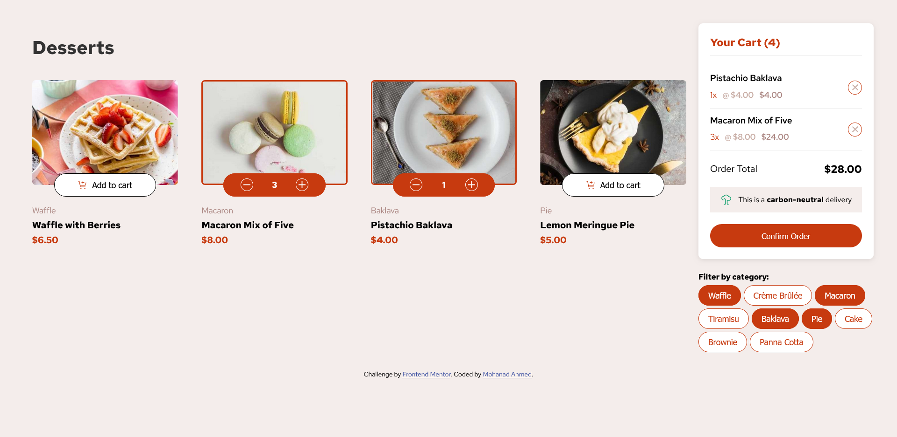

# Konecta task 1 - Product list with cart

This is a solution to the [Product list with cart challenge on Frontend Mentor](https://www.frontendmentor.io/challenges/product-list-with-cart-5MmqLVAp_d). This is the first task for the [Konecta](https://konecta.com/) fullstack development internship.

## Table of contents

- [Overview](#overview)
  - [The challenge](#the-challenge)
  - [Screenshot](#screenshot)
  - [Links](#links)
- [My process](#my-process)
  - [Built with](#built-with)
  - [Continued development](#continued-development)
  - [Useful resources](#useful-resources)
- [Author](#author)

## Overview

### The challenge

Users should be able to:

- Add items to the cart and remove them
- Increase/decrease the number of items in the cart
- See an order confirmation modal when they click "Confirm Order"
- Reset their selections when they click "Start New Order"
- View the optimal layout for the interface depending on their device's screen size
- See hover and focus states for all interactive elements on the page

Added features not part of the challenge:

- Printing a receipt in a new tab after clicking "Start New Order"
- Filtering products by categories

### Screenshot

### Links

- Live Site URL: [Add live site URL here](https://your-live-site-url.com)

## My process

### Built with

- HTML
- CSS
- Flexbox
- CSS Grid
- JavaScript

### Continued development

Adding a search and more filters would be beneficial when the number of products grow larger

### Useful resources

- [chip UI design](https://www.setproduct.com/blog/chip-ui-design) - This helped me create a user friendly UI for the filter chips.

## Author

- Website - [Mohanad Ahmed](https://mohanad-80.github.io/new-portfolio/)
